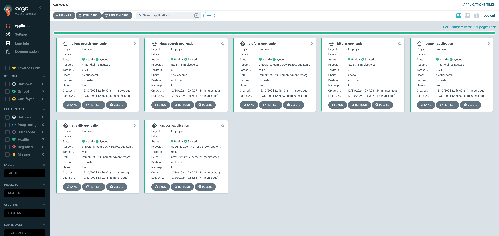
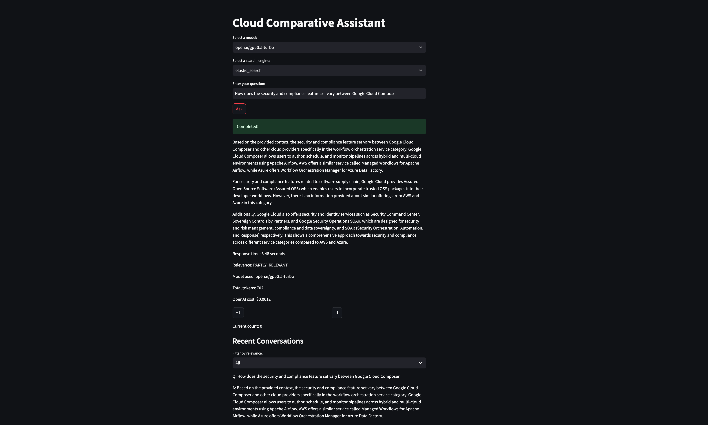
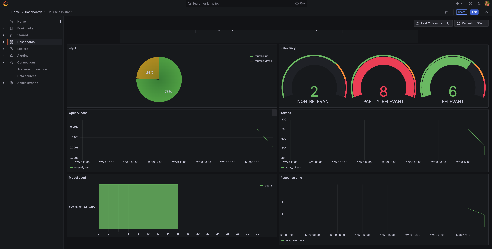

#  Cloud Services Comparison Assistant


<p align="center">
  
</p>

As a multi cloud engineer stay updated with the numerious services and 
resource across the three major cloud vendor can be challenging especially for beginners trying to switch from one vendor to another

The Cloud Services Comparison Assistant provides a conversational AI that helps
Engineers choose resources across the major cloud vendor and also get their alternatives with google cloud as the point of reference.


This project was implemented for 
[LLM Zoomcamp](https://github.com/DataTalksClub/llm-zoomcamp) -
a free course about LLMs and RAG.

<p align="center">
  
</p>


## Project overview

The Cloud Services Comparison Assistant is a RAG application designed to assist
cloud engineer as a comparative quide across the different major cloud vendor.

The main use cases include:

1. Google Cloud Service Selection: Recommending exercises based on the type
of activity, targeted muscle groups, or available equipment.
2. Other vendors Alternative: Replacing an exercise with suitable
alternatives.
3. Links to documentation (Google Cloud): Providing guidance on how to perform a
specific exercise.
4. Conversational Interaction: Making it easy to get information
without sifting through manuals or websites.

## Dataset

The dataset used in this project contains information about
various service, including:

Service category,Service type,Link to Documentation,Google Cloud product,Google Cloud product description,AWS offering,Azure offering
- **Service Category:** The name of the exercise (e.g., Push-Ups, Squats).
- **Service Type:** The general category of the exercise (e.g., Strength, Mobility, Cardio).
- **Google Cloud Product:** The part of the body primarily targeted by the exercise (e.g., Upper Body, Core, Lower Body).
- **Documentation Link:** The equipment needed for the exercise (e.g., Bodyweight, Dumbbells, Kettlebell).
- **Product Description:** The movement type (e.g., Push, Pull, Hold, Stretch).
- **AWS Offering:** The specific muscles engaged during
- **Azure Offering:** Step-by-step guidance on how to perform the

The dataset was extracted from googlre documentation and contains 222 records. It serves as the foundation for the Comparartive Cloud product recommendations and instructional support for Cloud Engineers aspiring to pick up multi-cloud with google as the reference point.

You can find the data in [`data`](data/raw_data.csv).

## Technologies
   [](#) [](#) [](#) [](#)     <a href='https://cdn.worldvectorlogo.com/logos/prefect-1.svg' target="_blank"></a> <a href='' target="_blank"></a>  
- Python 3.12
- Docker for containerization
- Kubernetes for container orchestration
- AWS as the cloud vendor for the various networking, compute, storage and kubernetes resources
- [Minsearch](https://github.com/alexeygrigorev/minsearch) for full-text search
- Streamlit as the web interface
- Grafana for monitoring
- RDS PostgreSQL for both the sreamlit and gradfana  backend
- OpenAI and Ollam as an LLM
- ElaticSearch as the vector databaseb for retrieval
- Terraform as the IAC tool
- Helm for workload deployment in kubernetes

## Cloud Technologies

- VPC (aws_vpc.eks)
- Subnets: Public and Private
  - aws_subnet.eks-public-one
  - aws_subnet.eks-public-two
  - aws_subnet.eks-private-one
  - aws_subnet.eks-private-two
- Route Tables and Associations: Public and Private
  - aws_route_table.eks-public
  - aws_route_table.eks-private
- Internet Gateway (aws_internet_gateway.eks-internet-gateway)
- NAT Gateway (aws_nat_gateway.eks-nat-gateway)
- Security Groups:
  - aws_security_group.eks-public
  - aws_security_group.eks-private
- EKS Cluster (aws_eks_cluster.eks)
  - Node Group: (aws_eks_node_group.eks)
- IAM Roles and Policies:
  - Cluster Role (aws_iam_role.eksClusterRole)
  - Node Role (aws_iam_role.eks-node-role)
  - Add-ons and Supporting Resources:
- Add-ons like vpc-cni, coredns, etc.
- Database resources, ECR, and Docker build configurations.


## Running the application

- Create python virtual environment

```

python3 -m venv llm_project_env

```

- Activate the environment

```
source llm_project_env/bin/activate

```
- install packages
```
pip install -r infrastructure/streamlit/requirements.txt

```
- create terraform backend in aws
```
aws s3api create-bucket --bucket llm-terraform-backend  --region eu-central-1  --create-bucket-configuration LocationConstraint=eu-central-1 
```

- run terraform command 
```
sh infra_up.sh
```

- set up access to aws secret manager for the cluster for secrets
```
bash script/secret_manager.sh
```

- create namespace
```
kubectl create namespace argocd
kubectl create namespace llm
```

- argocd deployment
```
helm repo add argo https://argoproj.github.io/argo-helm
helm repo add external-secrets https://charts.external-secrets.io
```

- external_secrets_setup 
```
bash script/secret_manager.sh

```
- secret_store_setup 
```
helm upgrade --install external-secrets external-secrets/external-secrets  -f  argocd/deployment_manifests/helm_values/secret_values.yaml


kubectl apply -f argocd/deployment_manifests/secret/service_account.yaml

kubectl apply -f  argocd/deployment_manifests/secret/secret-store.yml

kubectl apply -f argocd/deployment_manifests/secret/argocd-aws-secret.yaml
```

- argo_deployment_setup 
```

helm repo add argo https://argoproj.github.io/argo-helm

helm upgrade --install argocd argo/argo-cd --version 7.5.2  -f argocd/deployment_manifests/helm_values/values.yaml --debug

kubectl apply -f argocd/project_manifests/llm-project.yaml
```

- llm_infra_support_setup

```
kubectl apply -f argocd/application_manifests/support.yaml
```
- llm_elasticsearch_setup
```

kubectl apply -f argocd/application_manifests/elastic_search.yaml
```
- llm_streamlit_grafana_setup

```
kubectl apply -f argocd/application_manifests/streamlit.yaml

kubectl apply -f argocd/application_manifests/grafana.yaml

```
- run preparation


```

touch infrastructure/streamlit/app/.env


'''
fill with the following parameters

POSTGRES_HOST=
POSTGRES_DB=
POSTGRES_USER=
POSTGRES_PASSWORD=
POSTGRES_PORT=


ELASTIC_URL=


INDEX_NAME=

ELASTIC_USERNAME=
ELASTIC_PASSWORD=
MODEL_NAME=
'''

python3 infrastructure/streamlit/app/prep.py

```

<p align="center">
  
</p>
## Using the application

<p align="center">
  
</p>

## Experiments

We have the following notebooks:

- [`load_vector_database.ipynb`](data_preparation/load_vector_database.ipynb): Clean, embed and load data into the elasticsearch database.
- [`groud_truth_preparation.ipynb`](data_preparation/groud_truth_preparation.ipynb): Generating the ground truth dataset for retrieval and rag evaluation.
- [`text_eval.ipynb`](text_retrieval_evaluation/text_eval.ipynb): Text retrieval evaluation.
- [`vector_eval.ipynb`](vector_retrieval_evaluation/vector_eval.ipynb): Vector retrival evaluation.
- [`hybird_search_reranking.ipynb`](vector_retrieval_evaluation/hybird_search_reranking.ipynb): Hybird search and reranking for improved vector retrieval.
- [`rag_eval.ipynb`](rag_evaluation/rag_eval.ipynb): Rag evaluation.


### Text Retrieval evaluation

The first approach - using `minsearch` without any boosting - gave the following metrics:

- Hit rate: 89%
- MRR: 75%

The improved version (with tuned boosting):

- Hit rate: 92%
- MRR: 81%

The best boosting parameters:

```python
best_boost = {'Service_Category': 0.10638495651755087,
  'Service_Type': 1.269946147222612,
  'Link_to_Documentation': 1.5531045466189122,
  'Google_Cloud_Product': 1.3250028735372683,
  'Google_Cloud_Product_Description': 1.9395345731534959,
  'AWS_Offering': 2.067143729150134,
  'Azure_Offering': 0.799844469488588}
```

The second approach - using `elastic search` without any boosting - gave the following metrics:

- Hit rate: 86%
- MRR: 75%

### Embedded Vector Retrieval evaluation

The first approach - using `elastic search` with only the cloud product description embeddings - gave the following metrics:

- Hit rate: 54%
- MRR: 40%

The improved version (with all fields concantenated and embedded) gave an improved metrics:

- Hit rate: 90%
- MRR: 78%

The second approach - using `elastic search` with all fields concantenated and embedded together with hybird search and reranking incoperated  - gave the following metrics:

- Hit rate: 95%
- MRR: 84%

### RAG flow evaluation

We used the LLM-as-a-Judge metric to evaluate the quality
of our RAG flow.

For `gpt-4o-mini`, in a sample with 200 records, we had:

- 167 (64%) `RELEVANT`
- 30 (31%) `PARTLY_RELEVANT`
- 3 (5%) `NON_RELEVANT`


## Monitoring

We use Grafana for monitoring the application. 

It's accessible at [localhost:3000](http://localhost:3000):

- Login: "admin"
- Password: "admin"

### Dashboards

<p align="center">
  
</p>

The monitoring dashboard contains several panels:


1. **+1/-1 (Pie Chart):** A pie chart that visualizes the feedback from users, showing the count of positive (thumbs up) and negative (thumbs down) feedback received. This panel helps track user satisfaction.
2. **Relevancy (Gauge):** A gauge chart representing the relevance of the responses provided during conversations. The chart categorizes relevance and indicates thresholds using different colors to highlight varying levels of response quality.
3. **OpenAI Cost (Time Series):** A time series line chart depicting the cost associated with OpenAI usage over time. This panel helps monitor and analyze the expenditure linked to the AI model's usage.
4. **Tokens (Time Series):** Another time series chart that tracks the number of tokens used in conversations over time. This helps to understand the usage patterns and the volume of data processed.
5. **Model Used (Bar Chart):** A bar chart displaying the count of conversations based on the different models used. This panel provides insights into which AI models are most frequently used.
6. **Response Time (Time Series):** A time series chart showing the response time of conversations over time. This panel is useful for identifying performance issues and ensuring the system's responsiveness.


## Acknowledgements 

